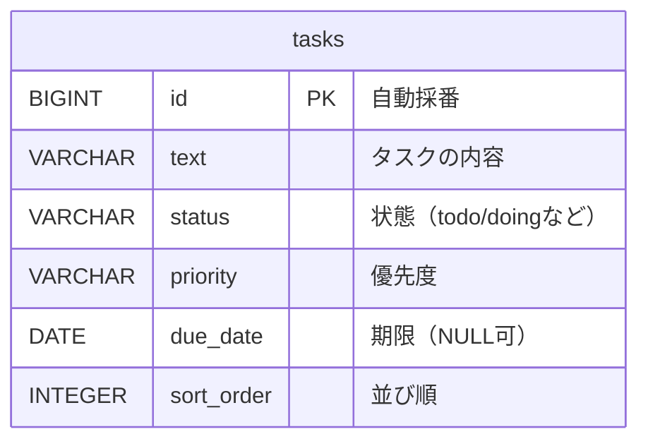

# DB設計書

`taskmanagement` アプリのデータベース設計。ER図とテーブル定義をまとめる。

## ER図

現時点では `tasks` テーブル1つのみのシンプルな構成。

テーブル間の関連（線）は、関連するテーブルが増えたとき（例: `users`テーブルを追加して「1人のユーザーが複数のタスクを持つ」関係を表すときなど）に追加する。

## テーブル定義

### tasks テーブル

タスク1件を1行で表すテーブル。[Task.java](src/main/java/com/taskmanagement/backend/task/Task.java) のエンティティ定義に対応する。

| カラム名 | 型 | NULL許可 | キー・制約 | 説明 |
|---|---|---|---|---|
| id | BIGINT | 不可 | PK（主キー、自動採番） | タスクを一意に識別する番号 |
| text | VARCHAR(255) | 不可 | NOT NULL | タスクの内容（255文字まで） |
| status | VARCHAR(255) | 不可 | NOT NULL | タスクの状態（todo, doing, done のどれか） |
| priority | VARCHAR(255) | 不可 | NOT NULL | 優先度（high, medium, low のどれか） |
| due_date | DATE | 可 | - | 期限日。未設定の場合はNULL |
| sort_order | INTEGER | 不可 | NOT NULL | 同じstatus内での並び順（小さいほど上。削除で番号が飛ぶことがあり、0から連番とは限らない） |

※ VARCHAR の長さ（255）は、Hibernate が文字の列を作るときの既定の長さ。
※ status・priority は、Java の中では enum（[TaskStatus.java](src/main/java/com/taskmanagement/backend/task/TaskStatus.java)・[TaskPriority.java](src/main/java/com/taskmanagement/backend/task/TaskPriority.java)）で持ち、DB には小文字の文字（`todo`・`high` など）で保存する。変換は [TaskStatusConverter.java](src/main/java/com/taskmanagement/backend/task/TaskStatusConverter.java)・[TaskPriorityConverter.java](src/main/java/com/taskmanagement/backend/task/TaskPriorityConverter.java) が受け持つ（JPA 標準の `@Enumerated(EnumType.STRING)` は大文字の `TODO` で保存するため使っていない）。

### インデックス

| インデックス名 | 対象カラム | 目的 |
|---|---|---|
| （主キーインデックス） | id | 主キーとして自動作成。1件のタスクをidで高速に取得する |
| idx_tasks_status_sort_order | status, sort_order（複合） | ①タスク取得の高速化（statusによる絞り込み）と②カラム内の表示順でのソート高速化（sort_orderによる並び替え）を1つのインデックスで両立させる |

### アプリ側バリデーション（DBの制約とは別レイヤー）

DBのNOT NULL制約は「NULLかどうか」しか防げないため、「空文字（`""`）」や「空白だけの文字列（`"   "`）」はDBレベルでは弾けない。また、255文字を超える文字列や、決められた値以外の status・priority も、DBに届いてから失敗したり、そのまま入ってしまったりする。これを防ぐため、アプリ側（Java）でバリデーションを追加している。

text や必須のチェック（`@NotBlank`・`@Size`・`@NotNull` など）は、[TaskController.java](src/main/java/com/taskmanagement/backend/task/TaskController.java) の `@Valid` で行う。status・priority は enum なので、決まった値以外は JSON を読む時点（`@JsonCreator`）で断られる。

| API | 対象 | チェック内容 | 実装場所 |
|---|---|---|---|
| POST・PUT | text | 必須。空文字・空白だけは不可（`@NotBlank`）。255文字まで（`@Size`） | [TaskRequest.java](src/main/java/com/taskmanagement/backend/task/TaskRequest.java) |
| POST・PUT | status | 省略可（省略時は todo）。送るなら todo / doing / done のどれか（enum） | 同上 |
| POST・PUT | priority | 省略可（省略時は medium）。送るなら high / medium / low のどれか（enum） | 同上 |
| PATCH | text | 省略可。送るなら空白だけは不可（`@Pattern`）、255文字まで（`@Size`） | [TaskPatchRequest.java](src/main/java/com/taskmanagement/backend/task/TaskPatchRequest.java) |
| PATCH | status・priority | 省略可。送るなら決められた値のどれか（enum） | 同上 |
| 並び替え（PUT /reorder） | status | 必須（`@NotNull`）。todo / doing / done のどれか（enum） | [ReorderRequest.java](src/main/java/com/taskmanagement/backend/task/ReorderRequest.java) |
| 並び替え（PUT /reorder） | orderedIds | 必須（`@NotNull`）。中に空（null）の ID を含めない | 同上 |

違反した場合は `400 Bad Request` が返り、DBには何も書き込まれない。DBのNOT NULL制約が「最低限の防波堤（NULLだけは防ぐ）」、アプリ側のバリデーションが「実用的な入力チェック（空文字・長さ・決められた値も防ぐ）」という役割分担になっている。

補足:
- `id` は `GenerationType.IDENTITY` で、行を追加するたびにデータベース側が自動で採番する
- `sort_order` はアプリ側（[TaskService.java](src/main/java/com/taskmanagement/backend/task/TaskService.java)）が自動計算して設定するため、API利用者が指定する項目ではない。新しいタスクや、別の列に移ったタスクは「その列の最大値＋1」（列の一番下）になる
- テーブル・カラムの実体は、アプリ起動時にHibernateが `Task.java` の定義から自動生成する（`spring.jpa.hibernate.ddl-auto=update`）
- `idx_tasks_status_sort_order` は [TaskRepository.java](src/main/java/com/taskmanagement/backend/task/TaskRepository.java) の `findTopByStatusOrderBySortOrderDesc`（列の一番下の1件）/ `findAllByOrderByStatusAscSortOrderAsc` の検索・ソート処理を高速化するために付与した（[Task.java](src/main/java/com/taskmanagement/backend/task/Task.java) の `@Table(indexes = ...)` で定義）
