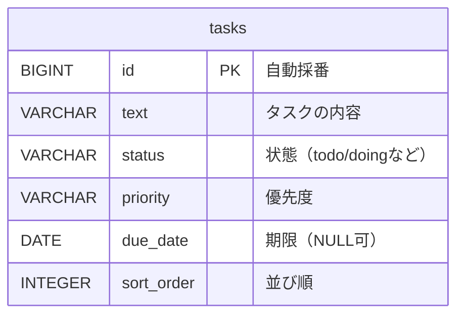

# DB設計書

`taskmanagement` アプリのデータベース設計。ER図とテーブル定義をまとめる。

## ER図

現時点では `tasks` テーブル1つのみのシンプルな構成。

テーブル間の関連（線）は、関連するテーブルが増えたとき（例: `users`テーブルを追加して「1人のユーザーが複数のタスクを持つ」関係を表すときなど）に追加する。

## テーブル定義

### tasks テーブル

タスク1件を1行で表すテーブル。[Task.java](src/main/java/com/taskmanagement/backend/task/Task.java) のエンティティ定義に対応する。

| カラム名 | 型 | NULL許可 | キー・制約 | 説明 |
|---|---|---|---|---|
| id | BIGINT | 不可 | PK（主キー、自動採番） | タスクを一意に識別する番号 |
| text | VARCHAR | 不可 | NOT NULL | タスクの内容 |
| status | VARCHAR | 不可 | NOT NULL | タスクの状態（例: todo, doing, done） |
| priority | VARCHAR | 不可 | NOT NULL | 優先度（例: low, medium, high） |
| due_date | DATE | 可 | - | 期限日。未設定の場合はNULL |
| sort_order | INTEGER | 不可 | NOT NULL | 同じstatus内での並び順（0から始まる） |

### インデックス

| インデックス名 | 対象カラム | 目的 |
|---|---|---|
| （主キーインデックス） | id | 主キーとして自動作成。1件のタスクをidで高速に取得する |
| idx_tasks_status_sort_order | status, sort_order（複合） | ①タスク取得の高速化（statusによる絞り込み）と②カラム内の表示順でのソート高速化（sort_orderによる並び替え）を1つのインデックスで両立させる |

### アプリ側バリデーション（DBの制約とは別レイヤー）

DBのNOT NULL制約は「NULLかどうか」しか防げないため、「空文字（`""`）」や「空白だけの文字列（`"   "`）」はDBレベルでは弾けない。これを防ぐため、アプリ側（Java）でバリデーションを追加している。

| 対象 | チェック内容 | 実装場所 |
|---|---|---|
| text | 空文字・空白だけの文字列を禁止（前後の空白を除いた上で1文字以上必須） | [TaskRequest.java](src/main/java/com/taskmanagement/backend/task/TaskRequest.java) の `@NotBlank`、[TaskController.java](src/main/java/com/taskmanagement/backend/task/TaskController.java) の `@Valid` |

違反した場合は `400 Bad Request` が返る。DBのNOT NULL制約が「最低限の防波堤（NULLだけは防ぐ）」、アプリ側の`@NotBlank`が「実用的な入力チェック（空文字・空白も防ぐ）」という役割分担になっている。

補足:
- `id` は `GenerationType.IDENTITY` で、行を追加するたびにデータベース側が自動で採番する
- `sort_order` はアプリ側（[TaskController.java](src/main/java/com/taskmanagement/backend/task/TaskController.java)）が自動計算して設定するため、API利用者が指定する項目ではない
- テーブル・カラムの実体は、アプリ起動時にHibernateが `Task.java` の定義から自動生成する（`spring.jpa.hibernate.ddl-auto=update`）
- `idx_tasks_status_sort_order` は [TaskRepository.java](src/main/java/com/taskmanagement/backend/task/TaskRepository.java) の `findByStatusOrderBySortOrderAsc` / `findAllByOrderByStatusAscSortOrderAsc` の検索・ソート処理を高速化するために付与した（[Task.java](src/main/java/com/taskmanagement/backend/task/Task.java) の `@Table(indexes = ...)` で定義）
