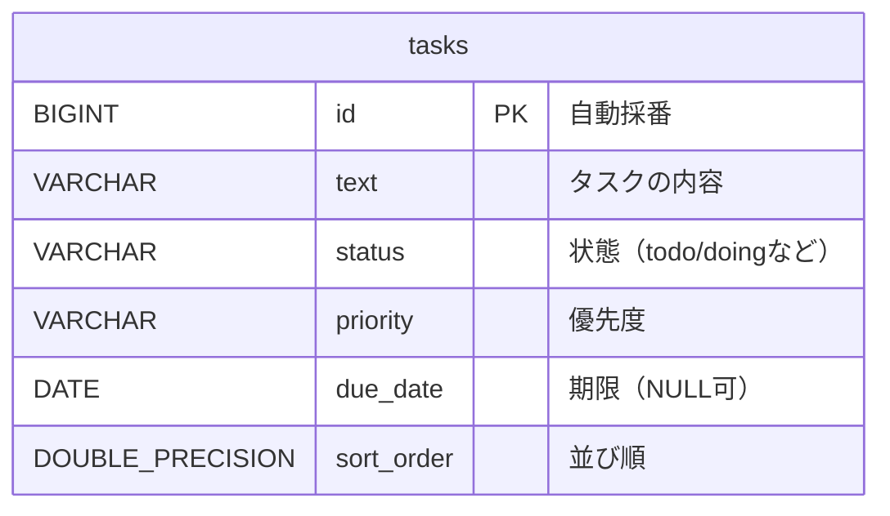

# DB設計書

`taskmanagement` アプリのデータベース設計。ER図とテーブル定義をまとめる。

## ER図

現時点では `tasks` テーブル1つのみのシンプルな構成。

```mermaid
erDiagram
    tasks {
        BIGINT id PK "自動採番"
        VARCHAR text "タスクの内容"
        VARCHAR status "状態（todo/doingなど）"
        VARCHAR priority "優先度"
        DATE due_date "期限（NULL可）"
        DOUBLE_PRECISION sort_order "並び順"
    }
```

テーブル間の関連（線）は、関連するテーブルが増えたとき（例: `users`テーブルを追加して「1人のユーザーが複数のタスクを持つ」関係を表すときなど）に追加する。

## テーブル定義

### tasks テーブル

タスク1件を1行で表すテーブル。[Task.java](src/main/java/com/taskmanagement/backend/task/Task.java) のエンティティ定義に対応する。テーブルを作る SQL は [V1__create_tasks_table.sql](src/main/resources/db/migration/V1__create_tasks_table.sql)（下の「テーブルの変更の記録（Flyway）」を参照）。

| カラム名 | 型 | NULL許可 | キー・制約 | 説明 |
|---|---|---|---|---|
| id | BIGINT | 不可 | PK（主キー、自動採番） | タスクを一意に識別する番号 |
| text | VARCHAR(255) | 不可 | NOT NULL | タスクの内容（255文字まで） |
| status | VARCHAR(255) | 不可 | NOT NULL | タスクの状態（todo, doing, done のどれか） |
| priority | VARCHAR(255) | 不可 | NOT NULL | 優先度（high, medium, low のどれか） |
| due_date | DATE | 可 | - | 期限日。未設定の場合はNULL |
| sort_order | DOUBLE PRECISION | 不可 | NOT NULL | 同じstatus内での並び順（小さいほど上。小数なので、2件の間（例：0 と 1 の間の 0.5）にも入れられる。削除や移動で番号が飛んだり、マイナスになったりすることがあり、0から連番とは限らない） |

※ VARCHAR の長さ（255）は、Flyway を入れる前に Hibernate がテーブルを自動で作っていたときの既定の長さ。V1 の SQL もそれに合わせている。
※ status・priority は、Java の中では enum（[TaskStatus.java](src/main/java/com/taskmanagement/backend/task/TaskStatus.java)・[TaskPriority.java](src/main/java/com/taskmanagement/backend/task/TaskPriority.java)）で持ち、DB には小文字の文字（`todo`・`high` など）で保存する。変換は [TaskStatusConverter.java](src/main/java/com/taskmanagement/backend/task/TaskStatusConverter.java)・[TaskPriorityConverter.java](src/main/java/com/taskmanagement/backend/task/TaskPriorityConverter.java) が受け持つ（JPA 標準の `@Enumerated(EnumType.STRING)` は大文字の `TODO` で保存するため使っていない）。

### インデックス

| インデックス名 | 対象カラム | 目的 |
|---|---|---|
| （主キーインデックス） | id | 主キーとして自動作成。1件のタスクをidで高速に取得する |
| idx_tasks_status_sort_order | status, sort_order（複合） | ①タスク取得の高速化（statusによる絞り込み）と②カラム内の表示順でのソート高速化（sort_orderによる並び替え）を1つのインデックスで両立させる |

### アプリ側バリデーション（DBの制約とは別レイヤー）

DBのNOT NULL制約は「NULLかどうか」しか防げないため、「空文字（`""`）」や「空白だけの文字列（`"   "`）」はDBレベルでは弾けない。また、255文字を超える文字列や、決められた値以外の status・priority も、DBに届いてから失敗したり、そのまま入ってしまったりする。これを防ぐため、アプリ側（Java）でバリデーションを追加している。

text や必須のチェック（`@NotBlank`・`@Size`・`@NotNull` など）は、[TaskController.java](src/main/java/com/taskmanagement/backend/task/TaskController.java) の `@Valid` で行う。status・priority は enum なので、決まった値以外は JSON を読む時点（`@JsonCreator`）で断られる。

| API | 対象 | チェック内容 | 実装場所 |
|---|---|---|---|
| POST・PUT | text | 必須。空文字・空白だけは不可（`@NotBlank`）。255文字まで（`@Size`） | [TaskRequest.java](src/main/java/com/taskmanagement/backend/task/TaskRequest.java) |
| POST・PUT | status | 省略可（省略時は todo）。送るなら todo / doing / done のどれか（enum） | 同上 |
| POST・PUT | priority | 省略可（省略時は medium）。送るなら high / medium / low のどれか（enum） | 同上 |
| PATCH | text | 省略可。送るなら空白だけは不可（`@Pattern`）、255文字まで（`@Size`） | [TaskPatchRequest.java](src/main/java/com/taskmanagement/backend/task/TaskPatchRequest.java) |
| PATCH | status・priority | 省略可。送るなら決められた値のどれか（enum） | 同上 |
| 並び替え（PUT /reorder） | status | 必須（`@NotNull`）。todo / doing / done のどれか（enum） | [ReorderRequest.java](src/main/java/com/taskmanagement/backend/task/ReorderRequest.java) |
| 並び替え（PUT /reorder） | orderedIds | 必須（`@NotNull`）。中に空（null）の ID を含めない。別の列のタスクを含めない（含めると400） | 同上 |
| 移動（PUT /{id}/move） | status | 必須（`@NotNull`）。todo / doing / done のどれか（enum） | [MoveRequest.java](src/main/java/com/taskmanagement/backend/task/MoveRequest.java) |
| 移動（PUT /{id}/move） | prevId | 省略可（省略すると列の一番上）。あるタスクで、移動先の列にあり、動かすタスク自身ではないこと（ないと404、それ以外は400） | 同上 |
| 読み込み（POST /import） | version | 必須（`@NotNull`）。1 だけ（それ以外は400） | [TaskFile.java](src/main/java/com/taskmanagement/backend/task/TaskFile.java) |
| 読み込み（POST /import） | tasks | 必須（`@NotNull`）。10000件まで（`@Size`）。中に空（null）を含めない。1件1件を下の決まりでチェックする（`@Valid`） | 同上 |
| 読み込み（POST /import） | tasks[].text | 必須。空文字・空白だけは不可（`@NotBlank`）。255文字まで（`@Size`） | [TaskFileItem.java](src/main/java/com/taskmanagement/backend/task/TaskFileItem.java) |
| 読み込み（POST /import） | tasks[].status・priority・sortOrder | 必須（`@NotNull`。POST と違い、省略時の値は使わない）。status・priority は決められた値のどれか（enum） | 同上 |

違反した場合は `400 Bad Request` が返り、DBには何も書き込まれない。DBのNOT NULL制約が「最低限の防波堤（NULLだけは防ぐ）」、アプリ側のバリデーションが「実用的な入力チェック（空文字・長さ・決められた値も防ぐ）」という役割分担になっている。

補足:
- `id` は `GenerationType.IDENTITY` で、行を追加するたびにデータベース側が自動で採番する
- `sort_order` はアプリ側（[TaskService.java](src/main/java/com/taskmanagement/backend/task/TaskService.java)）が自動計算して設定するため、API利用者が指定する項目ではない。新しいタスクや、PUT・PATCH で別の列に移ったタスクは「その列の最大値＋1」（列の一番下）になる。ドラッグ（move）で動かしたタスクは「上のタスクと、DB で本当にそのすぐ下のタスクの真ん中」になり、ほかのタスクの値は変えない（真ん中の値が作れないほど近いときだけ、その列を 0, 1, 2… と振り直す）
- `idx_tasks_status_sort_order` は [TaskRepository.java](src/main/java/com/taskmanagement/backend/task/TaskRepository.java) の `findTopByStatusOrderBySortOrderDesc`（列の一番下の1件）/ 一覧の取得（[TaskService.java](src/main/java/com/taskmanagement/backend/task/TaskService.java) の `findTasks`。status→sort_order の順）の検索・ソート処理を高速化するために付与した（[V1__create_tasks_table.sql](src/main/resources/db/migration/V1__create_tasks_table.sql) の `CREATE INDEX` で定義）

## テーブルの変更の記録（Flyway）

テーブルの形（列・インデックス）は、Flyway の SQL ファイルとして記録する。アプリの起動時に、Flyway が `src/main/resources/db/migration` の `V番号__説明.sql` のうち、まだ当てていないものを番号の小さい順に DB へ当てる。どこまで当てたかは、DB の `flyway_schema_history` テーブルに記録される。

| ファイル | 内容 |
| --- | --- |
| `V1__create_tasks_table.sql` | tasks テーブルとインデックス `idx_tasks_status_sort_order` を作る（Flyway を入れる前に Hibernate が自動で作っていた形と同じ） |
| `V2__sort_order_to_double.sql` | `sort_order` を INTEGER から DOUBLE PRECISION（小数）に変える。今の整数の値はそのまま小数になる。検索・絞り込み中の並び替えで、2件の間に入れられるようにするため（イシュー #35） |

- Hibernate はテーブルを作ったり直したりしない（`spring.jpa.hibernate.ddl-auto=validate`）。起動時に Task.java とテーブルが合っているかを確かめ、合わなければ起動を止める
- Flyway を入れる前から使っていたデータ入りの DB は、`spring.flyway.baseline-on-migrate=true` により「V1 まで済み」（`BASELINE`）と記録され、V1 は流れない（データはそのまま）。空の DB（テスト・新しい環境）では V1 から流れる

### テーブルを変えるときの手順

1. 新しい番号の SQL ファイルを足す（例：`V2__add_memo_column.sql` に `ALTER TABLE tasks ADD COLUMN memo VARCHAR(255);`）
2. [Task.java](src/main/java/com/taskmanagement/backend/task/Task.java) を、変えたあとのテーブルに合わせる
3. このファイルの ER 図とテーブル定義を直す

一度当てた SQL ファイル（V1 など）は書き換えない。すでに当て終わった DB には、書き換えた内容が届かず、新しい DB とテーブルの形が食い違うため（書き換えると、Flyway が起動時に中身の違いに気づいて止める）。
