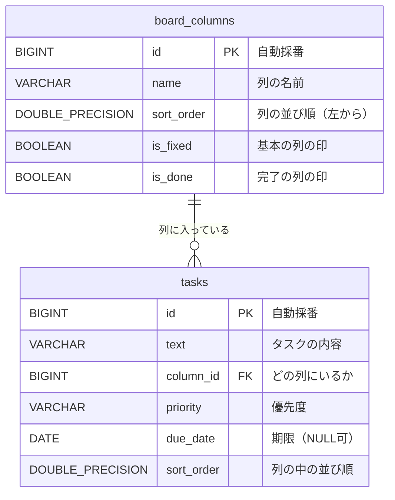

# DB設計書

`taskmanagement` アプリのデータベース設計。ER図とテーブル定義をまとめる。

## ER図

列（`board_columns`）とタスク（`tasks`）の2つのテーブルでできている。1つの列に、0件以上のタスクが入る。

```mermaid
erDiagram
    board_columns ||--o{ tasks : "列に入っている"
    board_columns {
        BIGINT id PK "自動採番"
        VARCHAR name "列の名前"
        DOUBLE_PRECISION sort_order "列の並び順（左から）"
        BOOLEAN is_fixed "基本の列の印"
        BOOLEAN is_done "完了の列の印"
    }
    tasks {
        BIGINT id PK "自動採番"
        VARCHAR text "タスクの内容"
        BIGINT column_id FK "どの列にいるか"
        VARCHAR priority "優先度"
        DATE due_date "期限（NULL可）"
        DOUBLE_PRECISION sort_order "列の中の並び順"
    }
```

## テーブル定義

### board_columns テーブル

ボードの列1つを1行で表すテーブル。[BoardColumn.java](src/main/java/com/taskmanagement/backend/column/BoardColumn.java) のエンティティ定義に対応する。テーブルを作る SQL は [V3__create_board_columns.sql](src/main/resources/db/migration/V3__create_board_columns.sql)（`is_fixed` は [V4__add_fixed_to_board_columns.sql](src/main/resources/db/migration/V4__add_fixed_to_board_columns.sql) で追加）。

| カラム名 | 型 | NULL許可 | キー・制約 | 説明 |
|---|---|---|---|---|
| id | BIGINT | 不可 | PK（主キー、自動採番） | 列を一意に識別する番号 |
| name | VARCHAR(255) | 不可 | NOT NULL | 列の名前（255文字まで） |
| sort_order | DOUBLE PRECISION | 不可 | NOT NULL | 列の並び順（小さいほど左）。新しい列は「最大値＋1」（右端）。並べ替えると 0, 1, 2… と振り直す |
| is_fixed | BOOLEAN | 不可 | NOT NULL、既定値 FALSE | 「基本の列」の印。やるべきこと・進行中・終わったことの3つだけが TRUE。基本の列は消せない |
| is_done | BOOLEAN | 不可 | NOT NULL、既定値 FALSE、TRUE は全体で1つまで | 「完了の列」の印（終わったこと）。完了ボタン（○）を押したタスクは、この列へ移る |

- V3 で、今までの3つの列（やるべきこと・進行中・終わったこと）を入れ、「終わったこと」に完了の印を付けた。V4 で、この3つに基本の列の印を付けた
- 基本の3列はカンバンの基本の流れ（未着手→作業中→完了）なので、消せない。消せるのは、あとから足した列（is_fixed が FALSE）だけ
- 完了の列は「終わったこと」に決まっていて、アプリでは印を付け替えない。完了の列は基本の列なので消せず、○ ボタンの移し先がなくなることも、列が1つもなくなることもない

### tasks テーブル

タスク1件を1行で表すテーブル。[Task.java](src/main/java/com/taskmanagement/backend/task/Task.java) のエンティティ定義に対応する。テーブルを作る SQL は [V1__create_tasks_table.sql](src/main/resources/db/migration/V1__create_tasks_table.sql)（その後 V2・V3 で変更。下の「テーブルの変更の記録（Flyway）」を参照）。

| カラム名 | 型 | NULL許可 | キー・制約 | 説明 |
|---|---|---|---|---|
| id | BIGINT | 不可 | PK（主キー、自動採番） | タスクを一意に識別する番号 |
| text | VARCHAR(255) | 不可 | NOT NULL | タスクの内容（255文字まで） |
| column_id | BIGINT | 不可 | NOT NULL、FK（`board_columns.id`） | どの列にいるか。外部キーなので、ない列の番号は書けず、タスクが入っている列は消せない |
| priority | VARCHAR(255) | 不可 | NOT NULL | 優先度（high, medium, low のどれか） |
| due_date | DATE | 可 | - | 期限日。未設定の場合はNULL |
| sort_order | DOUBLE PRECISION | 不可 | NOT NULL | 同じ列（column_id）内での並び順（小さいほど上。小数なので、2件の間（例：0 と 1 の間の 0.5）にも入れられる。削除や移動で番号が飛んだり、マイナスになったりすることがあり、0から連番とは限らない） |

※ VARCHAR の長さ（255）は、Flyway を入れる前に Hibernate がテーブルを自動で作っていたときの既定の長さ。V1 の SQL もそれに合わせている。
※ priority は、Java の中では enum（[TaskPriority.java](src/main/java/com/taskmanagement/backend/task/TaskPriority.java)）で持ち、DB には小文字の文字（`high` など）で保存する。変換は [TaskPriorityConverter.java](src/main/java/com/taskmanagement/backend/task/TaskPriorityConverter.java) が受け持つ（JPA 標準の `@Enumerated(EnumType.STRING)` は大文字の `HIGH` で保存するため使っていない）。
※ V3 より前は、列を `status`（todo・doing・done の文字）で持っていた。V3 で `column_id` に置き換え、`status` は消した。

### インデックス

| インデックス名 | 対象 | 目的 |
|---|---|---|
| （主キーインデックス） | 各テーブルの id | 主キーとして自動作成。1件を id で高速に取得する |
| idx_tasks_column_id_sort_order | tasks の column_id, sort_order（複合） | ①列ごとのタスクの取得と②列の中の表示順での並び替えを、1つのインデックスで速くする（V3 で、`idx_tasks_status_sort_order` から作り直した） |
| uq_board_columns_one_done | board_columns の is_done（`WHERE is_done` の部分インデックス、UNIQUE） | 完了の印（is_done = TRUE）が2つの列に付かないようにする。TRUE の行だけを見て、同じ値が2つあれば止める |

### アプリ側バリデーション（DBの制約とは別レイヤー）

DBのNOT NULL制約は「NULLかどうか」しか防げないため、「空文字（`""`）」や「空白だけの文字列（`"   "`）」はDBレベルでは弾けない。また、255文字を超える文字列や、決められた値以外の priority も、DBに届いてから失敗したり、そのまま入ってしまったりする。ない列の番号（column_id）は外部キーが止めるが、そのままだとわかりにくい 500 エラーになる。これを防ぐため、アプリ側（Java）でバリデーションを追加している。

text や必須のチェック（`@NotBlank`・`@Size`・`@NotNull` など）は、Controller の `@Valid` で行う。priority は enum なので、決まった値以外は JSON を読む時点（`@JsonCreator`）で断られる。columnId の列が本当にあるかは、[TaskService.java](src/main/java/com/taskmanagement/backend/task/TaskService.java) の `requireColumn` が確かめる。

| API | 対象 | チェック内容 | 実装場所 |
|---|---|---|---|
| POST・PUT | text | 必須。空文字・空白だけは不可（`@NotBlank`）。255文字まで（`@Size`） | [TaskRequest.java](src/main/java/com/taskmanagement/backend/task/TaskRequest.java) |
| POST・PUT | columnId | 省略可（POST は一番左の列、PUT は今の列）。送るなら、ある列の番号（ないと400） | 同上、TaskService |
| POST・PUT | priority | 省略可（省略時は medium）。送るなら high / medium / low のどれか（enum） | 同上 |
| PATCH | text | 省略可。送るなら空白だけは不可（`@Pattern`）、255文字まで（`@Size`） | [TaskPatchRequest.java](src/main/java/com/taskmanagement/backend/task/TaskPatchRequest.java) |
| PATCH | columnId・priority | 省略可。columnId はある列の番号（ないと400）、priority は決められた値のどれか（enum） | 同上 |
| 並び替え（PUT /reorder） | columnId | 必須（`@NotNull`） | [ReorderRequest.java](src/main/java/com/taskmanagement/backend/task/ReorderRequest.java) |
| 並び替え（PUT /reorder） | orderedIds | 必須（`@NotNull`）。中に空（null）の ID を含めない。別の列のタスクを含めない（含めると400） | 同上 |
| 移動（PUT /{id}/move） | columnId | 必須（`@NotNull`）。ある列の番号（ないと400） | [MoveRequest.java](src/main/java/com/taskmanagement/backend/task/MoveRequest.java) |
| 移動（PUT /{id}/move） | prevId | 省略可（省略すると列の一番上）。あるタスクで、移動先の列にあり、動かすタスク自身ではないこと（ないと404、それ以外は400） | 同上 |
| 読み込み（POST /import） | version | 必須（`@NotNull`）。1 か 2（それ以外は400） | [TaskFile.java](src/main/java/com/taskmanagement/backend/task/TaskFile.java) |
| 読み込み（POST /import、version 2） | columns | 1つ以上・100個まで。基本の列（fixed が true）はちょうど3つ。完了の列（done が true）はちょうど1つで、基本の列のどれか。タスクは全部で10000件まで | 同上、TaskService |
| 読み込み（POST /import、version 2） | columns[].name・tasks | name は必須・空白だけ不可・255文字まで。tasks は必須 | [TaskFileColumn.java](src/main/java/com/taskmanagement/backend/task/TaskFileColumn.java) |
| 読み込み（POST /import、version 2） | columns[].tasks[].text・priority | text は必須・空白だけ不可・255文字まで。priority は必須（決められた値のどれか） | [TaskFileItem.java](src/main/java/com/taskmanagement/backend/task/TaskFileItem.java) |
| 読み込み（POST /import、version 1） | tasks[]（text・status・priority・sortOrder） | 必須。status は todo / doing / done のどれか（それ以外は400） | [TaskFileV1Item.java](src/main/java/com/taskmanagement/backend/task/TaskFileV1Item.java)、TaskService |
| 列を作る・名前を変える | name | 必須。空白だけは不可（`@NotBlank`）。255文字まで（`@Size`） | [BoardColumnRequest.java](src/main/java/com/taskmanagement/backend/column/BoardColumnRequest.java) |
| 列を並べ替える | orderedIds | 全部の列の ID を1回ずつ（足りない・知らない・重なっていると400） | [BoardColumnService.java](src/main/java/com/taskmanagement/backend/column/BoardColumnService.java) |
| 列を消す | id | 基本の列（is_fixed が TRUE）・タスクが入っている列は消せない（409） | 同上 |

違反した場合は `400 Bad Request`（列の削除は `409 Conflict`）が返り、DBには何も書き込まれない。DBの制約が「最低限の防波堤」、アプリ側のバリデーションが「実用的な入力チェック（空文字・長さ・決められた値も防ぎ、わかりやすい理由を返す）」という役割分担になっている。

補足:
- `id` は `GenerationType.IDENTITY` で、行を追加するたびにデータベース側が自動で採番する
- `sort_order` はアプリ側（[TaskService.java](src/main/java/com/taskmanagement/backend/task/TaskService.java)）が自動計算して設定するため、API利用者が指定する項目ではない。新しいタスクや、PUT・PATCH で別の列に移ったタスクは「その列の最大値＋1」（列の一番下）になる。ドラッグ（move）で動かしたタスクは「上のタスクと、DB で本当にそのすぐ下のタスクの真ん中」になり、ほかのタスクの値は変えない（真ん中の値が作れないほど近いときだけ、その列を 0, 1, 2… と振り直す）
- `idx_tasks_column_id_sort_order` は [TaskRepository.java](src/main/java/com/taskmanagement/backend/task/TaskRepository.java) の `findTopByColumnIdOrderBySortOrderDesc`（列の一番下の1件）や、一覧の取得（`findTasks`。column_id→sort_order の順）の検索・ソートを速くするために付けた

## テーブルの変更の記録（Flyway）

テーブルの形（列・インデックス）は、Flyway の SQL ファイルとして記録する。アプリの起動時に、Flyway が `src/main/resources/db/migration` の `V番号__説明.sql` のうち、まだ当てていないものを番号の小さい順に DB へ当てる。どこまで当てたかは、DB の `flyway_schema_history` テーブルに記録される。

| ファイル | 内容 |
| --- | --- |
| `V1__create_tasks_table.sql` | tasks テーブルとインデックス `idx_tasks_status_sort_order` を作る（Flyway を入れる前に Hibernate が自動で作っていた形と同じ） |
| `V2__sort_order_to_double.sql` | `sort_order` を INTEGER から DOUBLE PRECISION（小数）に変える。今の整数の値はそのまま小数になる。検索・絞り込み中の並び替えで、2件の間に入れられるようにするため（イシュー #35） |
| `V3__create_board_columns.sql` | 列を自由に追加・削除できるようにする（イシュー #38）。board_columns テーブルを作って今までの3列を入れ、tasks の `status` を `column_id`（外部キー）に置き換える。今あるタスクは、status から対応する列の番号を書き写すので、消えない。インデックスも `idx_tasks_column_id_sort_order` に作り直す |
| `V4__add_fixed_to_board_columns.sql` | board_columns に「基本の列」の印 `is_fixed` を足し、やるべきこと・進行中・終わったことに付ける。基本の3列を消せないようにするため（イシュー #38。要件定義書 No.13 は「基本の3列『以外の』列を自由に作れる」こと） |

- Hibernate はテーブルを作ったり直したりしない（`spring.jpa.hibernate.ddl-auto=validate`）。起動時にエンティティとテーブルが合っているかを確かめ、合わなければ起動を止める
- Flyway を入れる前から使っていたデータ入りの DB は、`spring.flyway.baseline-on-migrate=true` により「V1 まで済み」（`BASELINE`）と記録され、V1 は流れない（データはそのまま）。空の DB（テスト・新しい環境）では V1 から流れる

### テーブルを変えるときの手順

1. 新しい番号の SQL ファイルを足す（例：`V5__add_memo_column.sql` に `ALTER TABLE tasks ADD COLUMN memo VARCHAR(255);`）
2. エンティティ（[Task.java](src/main/java/com/taskmanagement/backend/task/Task.java) など）を、変えたあとのテーブルに合わせる
3. このファイルの ER 図とテーブル定義を直す

一度当てた SQL ファイル（V1 など）は書き換えない。すでに当て終わった DB には、書き換えた内容が届かず、新しい DB とテーブルの形が食い違うため（書き換えると、Flyway が起動時に中身の違いに気づいて止める）。
