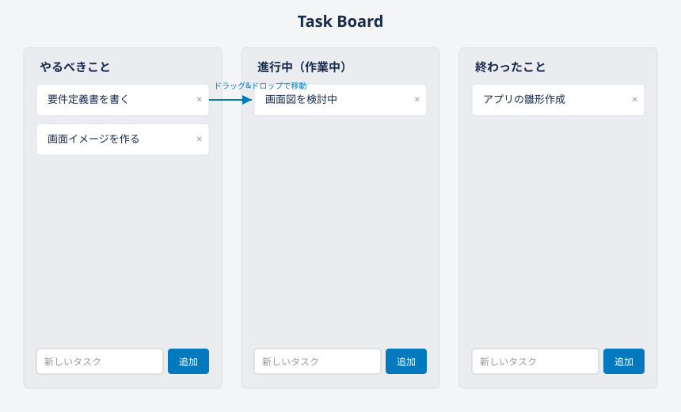

# タスク管理アプリ 要件定義書

## 1. 概要

Trelloのような、カード形式でタスクを管理するWebアプリを作成する。
本ドキュメントは学習目的で作成するアプリの要件を整理したものである。

## 2. 目的

- カンバン方式（列にカードを並べる方式）でタスクを視覚的に管理できるようにする
- HTML/CSS/JavaScriptの基礎（DOM操作、イベント処理、データ保存）を学ぶ

## 3. 対象ユーザー

- 開発者本人（個人利用・学習目的）

## 4. 利用環境

- 動作環境: Webブラウザ（Google Chrome等）
- サーバー: 不要（ブラウザ単体で完結）
- データ保存先: ブラウザの localStorage

## 5. 機能要件

### 5.1 v1のスコープ（実装済み＋実装対象）

以下はv1として取り組む機能。「状態」欄が「実装済み」以外のものは、これから実装する対象である。

| No  | 機能    | 内容                            | 状態 |
| --- | ----- | ----------------------------- | --- |
| 1   | 列表示   | 「やるべきこと」「進行中」「終わったこと」の3列を表示する | 実装済み |
| 2   | タスク追加 | 各列の入力欄からタスクを追加できる。追加時に優先度（既定は「中」）と期限日（任意）も合わせて設定できる。タスク名が空欄または空白のみの場合は、追加ボタンを押しても何も起こらない（カードは作成されず、エラー表示も行わない）※Trelloと同様の挙動 | 実装済み |
| 3   | タスク削除 | カードの「×」ボタンでタスクを削除できる          | 実装済み |
| 4   | タスク移動 | カードをドラッグ&ドロップして列を移動できる        | 実装済み |
| 5   | データ保存 | タスク情報はブラウザに保存し、再読み込みしても消えない   | 実装済み |
| 6   | 保存データ破損時の挙動 | アプリ起動時、保存データの読み込みに失敗した場合は「保存データが壊れています。空の状態から始めますか？」と確認メッセージを表示する。ユーザーが同意した場合のみタスクが1つもない状態で起動し、同意しない場合はそれ以上進めない | 実装済み |
| 7   | タスク編集 | 追加済みタスクの文言を後から編集できる | 実装済み |
| 8   | 期限設定 | タスクの追加時、および追加後にいつでも締切日を設定・変更できる | 実装済み |
| 9   | 優先度設定 | タスクの追加時、および追加後にいつでも「高・中・低」の優先度を設定・変更できる | 実装済み |

### 5.2 未実装・今後の拡張候補（v2以降）


| No  | 機能       | 内容                            | 優先度        |
| --- | -------- | ----------------------------- | ---------- |
| 10  | 検索・絞り込み  | タスク名で検索、優先度や期限で絞り込みできる        | 低          |
| 11  | 列の追加・削除  | 「To Do / 進行中 / 完了」以外の列を自由に作れる | 低          |
| 12  | 複数デバイス同期 | サーバー・データベースを用意し、他端末とも同期する     | 低（要サーバー実装） |
| 13  | データのエクスポート/インポート・バックアップ | タスクデータをファイルに書き出し・読み込みできるようにする。保存データが壊れた場合の復旧手段としても検討する | 低 |


※ v2以降の機能は本アプリの現段階では未着手。実装する場合は本書を更新すること。

## 6. 画面構成


### 6.1 このアプリの考え方（カンバン方式とは）

「カンバン方式」とは、タスクを1枚ずつカードにして、進み具合ごとに列（レーン）を分けて並べる管理方法である。
カードを別の列にドラッグ＆ドロップで移動させるだけで、タスクの状態（未着手→作業中→完了）を更新できる。
紙の付箋をホワイトボードに貼って進捗を動かしていくイメージに近い。有名なツールに Trello, Jira 等があるが、
本アプリはその基本機能のみを自作するものである。

### 6.2 画面イメージ



- 1画面構成（シングルページ）。ログインなどはなく、開くと即座にこの画面が表示される
- 画面内に3列（**やるべきこと** / **進行中＝作業中** / **終わったこと**）を横並びで表示
- 1つのタスク＝1枚の「カード」。カードは白背景の四角で表示され、右上に編集アイコン（✎）と削除の「×」を配置する
- カード下部に優先度（高・中・低、色つきの丸印で表示）と期限日を表示する
- カードをつかんで別の列にドラッグすると、タスクの状態（未着手→進行中→完了）が切り替わる
- 各列の下部に「タスク名入力欄＋追加ボタン」を配置し、その列に直接新しいタスクを追加できる
- 同一列内でのカードの並び替え（上下の順序変更）は行わない。列内の表示順は「タスクを追加した順」で固定とする
  ※将来、実際に使ってみて並び替えの必要性を感じた場合は、本書を更新した上でv2以降の機能として追加を検討する
- 列内にタスクが1件もない場合、「タスクがありません」等の案内文は表示せず、単に空の状態のまま表示する（Trelloと同様の挙動）


### 6.3 補足

- 上図はワイヤーフレーム（構成を示す簡易図）であり、実際の配色・フォントは実装（[style.css](style.css)）に準ずる
- 実物は [index.html](index.html) をブラウザで開くことで確認できる


## 7. データ構造

タスク1件を以下の形式で管理する（JavaScriptオブジェクト、localStorageにJSON形式で保存）。

```json
{
  "id": "タスクごとの一意なID（文字列）。crypto.randomUUID() を用いて生成する",
  "text": "タスクの内容（文字列）",
  "status": "todo | doing | done のいずれか",
  "priority": "high | medium | low のいずれか（新規追加時は medium）",
  "dueDate": "期限日（YYYY-MM-DD形式の文字列）。未設定の場合は空文字"
}
```


## 8. 非機能要件

- 特別なインストール作業なしに、HTMLファイルを開くだけで動作すること
- ブラウザを閉じてもデータが消えないこと（localStorage利用）
- 対応ブラウザ: 最新版のGoogle Chrome / Microsoft Edge
- タスク名にHTMLタグやスクリプトのような特殊な文字列が入力された場合でも、HTML/プログラムとして解釈せず、常に単なる文字列として画面に表示すること（例: `innerHTML`ではなく`textContent`を用いて描画する）
- 画面幅が狭い場合、3列の横並び表示は維持したまま、はみ出した分は横スクロールで閲覧できるようにする（`overflow-x: auto`等）。列を縦積みに組み替える等の複雑なレイアウト変更は行わない


## 9. 制約事項

- 現時点ではサーバーを持たないため、他人とタスクを共有する機能はない
- 同じブラウザ・同じ端末でのみデータが保持される（別端末からは見えない）
- ブラウザのキャッシュ削除等でデータが消える可能性がある
- 本アプリはlocalStorageが利用できる環境で使うことを前提とする。シークレットウィンドウ等、localStorageが制限された環境で保存できない場合の検知・通知は行わない
- カードの移動はマウス操作（ドラッグ&ドロップ）のみをサポートする。キーボード操作のみでのカード移動には対応しない
- スマートフォン等のタッチ操作には対応しない。スマホでは画面の閲覧のみ可能とし、タスクの追加・削除・移動等の操作はPC（マウス操作）で行うことを前提とする
- タッチ操作の画面（スマホ等）で表示した場合は、画面上部に「スマートフォンでは閲覧のみ可能です。タスクの追加・削除・移動はPCで行ってください」という注意文を常時表示する


## 10. 受け入れ基準（動作確認チェックリスト）

v1の各機能について、以下が満たされていることを確認する。

| No | 確認項目 | 確認内容 |
| --- | --- | --- |
| 1 | 列表示 | 「やるべきこと」「進行中」「終わったこと」の3列が表示される |
| 2 | タスク追加（正常系） | 入力欄に文字を入れて追加ボタンを押すと、対象の列にカードが1枚追加される。優先度・期限を指定して追加すると、その内容がカードに反映される |
| 3 | タスク追加（空欄） | 入力欄が空欄または空白のみの状態で追加ボタンを押しても、カードは追加されない（エラー表示もない） |
| 4 | タスク削除 | カードの「×」ボタンを押すと、そのカードが列から消える |
| 5 | タスク移動 | カードをドラッグして別の列にドロップすると、そのカードが移動先の列に表示される |
| 6 | 列内の表示順 | 同じ列内でカードを追加した順に上から並んで表示される（並び替えは行われない） |
| 7 | データ保存 | タスクを追加・削除・移動した後にブラウザをリロードしても、内容が保持されている |
| 8 | 文字列の安全表示 | タスク名にHTMLタグのような文字列（例: `<b>test</b>`）を入力しても、太字等に変換されずそのままの文字列として表示される |
| 9 | 保存データ破損時 | 保存データを意図的に壊した状態でアプリを開くと、「保存データが壊れています。空の状態から始めますか？」の確認メッセージが表示され、同意した場合のみ空の状態で起動する |
| 10 | 空の列の表示 | タスクが1件もない列を開いても、「タスクがありません」等の文言は表示されず、空のまま表示される |
| 11 | 画面幅が狭い場合の表示 | ブラウザの幅を狭くしても3列のレイアウトが崩れず、はみ出した分は横スクロールで見られる |
| 12 | スマホでの注意表示 | スマートフォン（タッチ操作の画面）で開くと、画面上部に「スマートフォンでは閲覧のみ可能です。タスクの追加・削除・移動はPCで行ってください」という注意文が表示される |
| 13 | タスク編集（正常系） | カードの編集アイコン（✎）でタスク名を変更して確定すると、カードの表示が更新され、リロード後も保持されている |
| 14 | タスク編集（空欄） | 編集中に文字を全て消して確定しても、カードは削除されず元のタスク名のまま変わらない |
| 15 | 優先度設定 | カードの優先度を高・中・低に変更すると、バッジの色とラベルが切り替わり、リロード後も保持されている |
| 16 | 期限設定 | カードに期限日を設定すると表示に反映され、リロード後も保持されている |

## 11. 今後の進め方

1. v1（実装済み機能）について、上記チェックリストに基づき動作確認を行う
2. v2以降の機能から優先度の高いものを選び、1つずつ実装する
3. 機能追加のたびに本書と [README.md](README.md) を更新する

