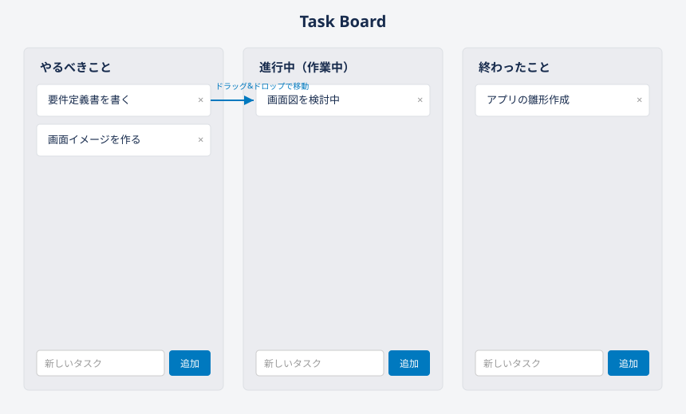

# タスク管理アプリ 要件定義書

## 1. 概要

Trelloのような、カード形式でタスクを管理するWebアプリを作成する。
本ドキュメントは学習目的で作成するアプリの要件を整理したものである。

初期版はHTML/CSS/素のJavaScriptのみで作成したプロトタイプ（[index.html](index.html) / [script.js](script.js) / [style.css](style.css)、データはブラウザのlocalStorageに保存）であった。
今回、技術スタックの指定によりフロントエンドをReact、バックエンドをJava（Spring Boot）+ PostgreSQLデータベースの構成に変更する（詳細は4節）。プロトタイプ版は移行前の参考実装として残す。

## 2. 目的

- カンバン方式（列にカードを並べる方式）でタスクを視覚的に管理できるようにする
- React（フロントエンド）とJava/Spring Boot（バックエンド）を用いたクライアント・サーバー構成のアプリ開発の基礎を学ぶ

## 3. 対象ユーザー

- 開発者本人（個人利用・学習目的）

## 4. 利用環境・システム構成

### 4.1 技術スタック

#### フロントエンド

| 区分 | 技術 | バージョン |
| --- | --- | --- |
| 実行環境 | Node.js | 24.21.0（LTS） |
| フレームワーク | React（画面を作る `react`・ブラウザに表示する `react-dom`。Next.js等のフレームワークは使用しない） | 19.3.0 |
| 言語 | TypeScript | 6.0.3 |
| ビルドツール | Vite | 8.3.0 |
| ビルドツールの部品 | @vitejs/plugin-react（Vite で React を動かす） | 6.1.1 |
| パッケージ管理 | npm | 11.19.0 |
| ドラッグ＆ドロップ | dnd-kit（@dnd-kit/core・@dnd-kit/sortable） | 6.3.1・10.0.0 |
| スタイリング | Tailwind CSS（`tailwindcss`・Vite で使うための `@tailwindcss/vite`） | 4.3.3 |
| 静的解析 | oxlint | 1.85.0 |

#### バックエンド

| 区分 | 技術 | バージョン |
| --- | --- | --- |
| 言語 | Java | 21（Eclipse Temurin 21.0.12.1、LTS） |
| フレームワーク | Spring Boot | 4.1.1 |
| ビルドツール | Gradle | 9.7.1（`gradlew`ラッパー経由） |
| ビルドツールの部品 | io.spring.dependency-management（Spring Boot が決めた組み合わせで部品を取り寄せる Gradle のプラグイン。`build.gradle` で直接指定） | 1.1.7 |
| API形式 | REST API | - |
| 静的解析 | PMD（Gradle の `pmd` プラグイン、規則は quickstart） | 7.24.0 |
| 書き方のチェック | Checkstyle（Gradle の `checkstyle` プラグイン、規則は `config/checkstyle/checkstyle.xml`） | 14.1.0 |

主要な部品（ライブラリ）。いずれも `build.gradle` で直接指定しているものではなく、Spring Boot 4.1.1 が組み合わせを決めて自動で取り寄せているもの。

| 区分 | 技術 | バージョン |
| --- | --- | --- |
| Web（REST API） | Spring Web MVC | 7.0.9 |
| Webサーバー（組み込み） | Apache Tomcat | 11.0.24 |
| JSON変換 | Jackson | 3.1.5 |
| DBアクセス | Spring Data JPA | 4.1.1 |
| DBアクセス（ORM） | Hibernate ORM | 7.4.5 |
| DBアクセス（決まりの本体） | Jakarta Persistence（`@Entity`・`@Column` など） | 3.2.0 |
| DB接続プール | HikariCP | 7.0.2 |
| DBドライバ | PostgreSQL JDBC Driver | 42.7.13 |
| 入力チェック | Hibernate Validator | 9.1.3 |
| 入力チェック（決まりの本体） | Jakarta Validation（`@NotNull`・`@Valid` など） | 3.1.1 |
| テーブルの変更の記録 | Flyway（`spring-boot-starter-flyway` 4.1.1・`flyway-database-postgresql`） | 12.4.0 |
| ログ | SLF4J（書く窓口）・Logback（実際に書き出す） | 2.0.18・1.5.38 |
| テスト | JUnit Jupiter | 6.0.3 |
| テスト（結果の確かめ） | AssertJ（`assertThat`） | 3.27.7 |
| テスト（API を呼ぶ道具） | Spring Test（`MockMvcTester`） | 7.0.9 |
| テスト（使い捨ての DB） | Testcontainers（`testcontainers-postgresql`・`testcontainers-junit-jupiter`） | 2.0.5 |
| テスト（Testcontainers と Spring Boot をつなぐ） | `spring-boot-testcontainers` | 4.1.1 |

#### データベース

| 区分 | 技術 | バージョン |
| --- | --- | --- |
| RDBMS | PostgreSQL（Dockerコンテナ） | 17.11（`docker-compose.yml`・テストの指定は `postgres:17`。コンテナを作り直すと、17 系の最新になる） |

#### 開発ツール

| 区分 | 技術 | バージョン |
| --- | --- | --- |
| バージョン管理 | Git | 2.55.0 |
| コンテナ | Docker（Docker Desktop。DB と、テストの Testcontainers が使う） | 29.8.0 |
| リポジトリホスティング | GitHub | - |
| 自動チェック（CI） | GitHub Actions（`.github/workflows/ci.yml`。PR と master へのプッシュで、フロントの lint・build と、バックエンドの `./gradlew check`（コンパイル・PMD・Checkstyle・テスト）を動かす） | actions/checkout v7・actions/setup-node v7・actions/setup-java v6・gradle/actions/setup-gradle v6 |

※ フロントエンドのバージョンは `frontend/package-lock.json` に実際にインストールされたもの。

### 4.2 全体構成

- ブラウザで動作するReact製フロントエンドが、Spring Bootで実装したREST APIにHTTP経由でアクセスする
- バックエンドはPostgreSQLデータベースに対してタスクデータの読み書きを行う
- 構成イメージ: `ブラウザ（React）→ HTTP(REST API) → Spring Boot → PostgreSQL`
- 動作環境: Webブラウザ（Google Chrome等）＋ バックエンドサーバー（Javaが動作する環境）＋ PostgreSQLサーバー

## 5. 機能要件

### 5.1 v1のスコープ（実装済み＋実装対象）

以下はv1として取り組む機能。

※ 「状態」欄は新構成（React + Spring Boot + PostgreSQL）での実装状況を示す。プロトタイプ版（HTML/CSS/JavaScript + localStorage）の機能は、すべて新構成に移植済み。新構成で動きが変わったところは、各行の「※新構成」に書く。

| No  | 機能    | 内容                            | 状態 |
| --- | ----- | ----------------------------- | --- |
| 1   | 列表示   | 「やるべきこと」「進行中」「終わったこと」の3列を表示する（※新構成では、この3列は最初に用意される列で、あとから列を足したり消したりできる。No.13 を参照） | 実装済み |
| 2   | タスク追加 | 各列の入力欄からタスクを追加できる。追加時に優先度（既定は「中」）と期限日（任意）も合わせて設定できる。タスク名が空欄または空白のみの場合は、追加ボタンを押しても何も起こらない（カードは作成されず、エラー表示も行わない）※Trelloと同様の挙動（※新構成でも、POST /api/tasks による登録を API・React 画面とも実装済み） | 実装済み |
| 3   | タスク削除 | カードの「×」ボタンでタスクを削除できる（※新構成でも実装済み。押し間違いを防ぐため、削除の前に「『タスク名』を削除しますか？」と確認し、OK のときだけ削除する） | 実装済み |
| 4   | タスク移動 | カードをドラッグ&ドロップして列を移動できる（※新構成でも実装済み。ドラッグ中は移動先の列のカードが場所を空け、着地点が見える。カード左の ○ を押すと、PATCH で「完了の列」（最初は「終わったこと」。No.13 を参照）の一番下に移る） | 実装済み |
| 5   | データ保存 | タスク情報を保存し、再読み込みしても消えない（※新構成では、ブラウザではなく PostgreSQL の `tasks` テーブルに保存する。ブラウザを閉じても、別のブラウザで開いても同じタスクが見える） | 実装済み |
| 6   | 読み込みに失敗したときの挙動 | アプリ起動時にタスクを読み込めなかった場合は、画面にエラーメッセージを表示する（※新構成での動き。プロトタイプ版の「保存データが壊れています。空の状態から始めますか？」の確認は、localStorage のデータが壊れたときのためのもので、新構成にはない。代わりに、バックエンドにつながらないときは「タスクを取得できませんでした。バックエンドにつながりません。起動しているか確認してください。」、バックエンドは動いているが DB などでエラーが起きたときは「タスクを取得できませんでした。サーバーでエラーが起きました。時間をおいて試してください。」と表示し、列は空のまま表示する。DB のデータは消さない。No.21 を参照） | 実装済み |
| 7   | タスク編集 | 追加済みタスクの文言を後から編集できる（※新構成でも、カードの ✎ から開くクイック編集で、タスク名・優先度・期限日をまとめて PUT で更新できる。タスク名が空欄なら元のまま） | 実装済み |
| 8   | 期限設定 | タスクの追加時、および追加後にいつでも締切日を設定・変更できる（※新構成でも、追加フォームとクイック編集で設定・変更・削除できる） | 実装済み |
| 9   | 優先度設定 | タスクの追加時、および追加後にいつでも「高・中・低」の優先度を設定・変更できる（※新構成でも、追加フォームとクイック編集で設定・変更できる） | 実装済み |
| 10  | 列内の手動並び替え | 同一列内でカードをドラッグして上下の順序を入れ替えられる（※新構成でも実装済み。検索・絞り込み中（No.12）もドラッグできる。No.16 を参照） | 実装済み |
| 11  | 列内の自動並び替え | 列ごとに「優先度順」「期限が近い順」を選ぶと、その列のカードが一括で並び替わる。選択後は再び手動でドラッグして順序を調整できる（※新構成でも実装済み。同じ優先度・同じ期限のカードどうしは、今の順番のまま残る。検索・絞り込み中は、見えているカードだけを、それらが今いる位置の中で並べ直す。見えていないカードの位置は変わらない。No.16 を参照） | 実装済み |

### 5.2 未実装・今後の拡張候補（v2以降）


| No  | 機能       | 内容                            | 優先度        |
| --- | -------- | ----------------------------- | ---------- |
| 12  | 検索・絞り込み  | タスク名で検索、優先度や期限で絞り込みできる（※実装済み：画面の上の検索欄で、タスク名のキーワード・優先度（高・中・低のチェックボックス。いくつでも選べる）・期限（「期限切れ」＝今日より前、「7日以内」＝今日〜今日＋6日、「期限なし」のセレクト）を選び、「検索」でまとめて絞り込む。条件を組み合わせると、全部を満たすタスクだけを出す（AND）。絞り込みは API（`GET /api/tasks` の `keyword`・`priority`・`due`）で行い、「今日」はサーバーの日付で決める。絞り込み中も並び替えできる（No.16）。イシュー #35 の A） | 実装済み |
| 13  | 列の追加・削除  | 「To Do / 進行中 / 完了」以外の列を自由に作れる（※実装済み：列を DB の `board_columns` テーブルに入れ、タスクは列を `status` ではなく列の番号（`column_id`、外部キー）で持つようにした（Flyway の `V3__create_board_columns.sql`。今あるタスクは元の列に入ったまま）。画面では、ボードの右端の「＋ 列を追加」で右端に列を足し、列の見出しの × で、確認のダイアログのあと列を消す。決めたルール：①タスクが入っている列は消せない（409。「先にタスクをほかの列へ移すか、消してください」と出る。検索・絞り込み中に見えていないタスクも数える）。②列の1つに「完了の列」の印を付け、カードの ○ はその列へ移す。印はいつもちょうど1つで、付け替えだけができる。③完了の列は消せない（× を出さない）。列を指定せずにタスクを作ると、一番左の列に入る。API には列の名前の変更・完了の列の付け替え・並べ替えもあるが、画面からはまだ操作できない。書き出しのファイルは列ごとの形（version 2）にし、version 1 のファイルも3列に入れて読み込める（No.15）。イシュー #38） | 実装済み |
| 14  | 複数デバイス同期 | サーバー・データベースを用意し、他端末とも同期する     | 低（要サーバー実装） |
| 15  | データのエクスポート/インポート・バックアップ | タスクデータをファイルに書き出し・読み込みできるようにする。保存データが壊れた場合の復旧手段としても検討する（※実装済み：画面の見出しの右の「⬇ 書き出す」で、全部のタスク（絞り込みに関係なく）を JSON のファイル `tasks-日付.json` に保存する。ファイルには版（`version`）・書き出した日時（`exportedAt`）・列の一覧（`columns`。列の名前・完了の列の印と、その列のタスクの一覧（タスク名・優先度・期限）。列もタスクも、書いた順が並び順。id は入れない）が入る（version 2。No.13 で列が自由になったため、#36 の version 1（タスクの一覧に列を `status` で書く形）から変えた。version 1 のファイルも、todo・doing・done を「やるべきこと／進行中／終わったこと」の3列に入れて読み込める）。「⬆ 読み込む」でファイルを選び、確認のダイアログで OK を押すと、今の列とタスクを全部消して、ファイルの列とタスクに置き換える（完了の列がちょうど1つでないファイルは 400 で断る）。読み込みは1つのトランザクションで行い、1件でもおかしければ 400 で何も変えない（全部か、何もしないか）。API は `GET /api/tasks/export`・`POST /api/tasks/import`。イシュー #36） | 実装済み |
| 16  | 検索中の並び替え | 検索・絞り込み（No.12）をしているときも、ドラッグ&ドロップで並び替えられるようにする。並び順を「前後のカードの間の番号（小数）」で持ち、動かしたカードの番号だけを変える方式にする必要がある（sortOrder の型の変更、並び替え API の作り直しを伴う）（※実装済み：`sort_order` を小数（DOUBLE PRECISION）にした（Flyway の `V2__sort_order_to_double.sql`）。ドラッグは `PUT /api/tasks/{id}/move` で、動かしたカードの番号だけを「すぐ上に見えているカード」と「DB で本当にそのすぐ下にあるカード（見えていなくてもよい）」の真ん中にする。番号のすき間がなくなったら、その列を 0, 1, 2… と振り直す。自動並び替えの `PUT /api/tasks/reorder` は、送ったカードどうしで今の番号（席）を入れ替える方式にした。どちらも見えていないカードの番号には触らないので、その順番はずれない。イシュー #35 の B） | 実装済み |
| 17  | 自動テスト | 削除や並び順の決め方（新しいカードは列の最大値＋1 の番号で一番下に入る）など、主な処理が正しく動くかを自動で確かめるテストを書く。コードを変えたときに、前に直した不具合が戻ってくる（デグレ）のを早く見つけるため。今あるバックエンドのテストは、アプリが起動できるかの確認（BackendApplicationTests）だけ。また、今のテストは起動中の Docker の DB に依存しているため、テストのたびに使い捨ての DB を用意する Testcontainers を入れ、GitHub Actions でもテストを動かせるようにする（2026-09-27 の品質チェック #11）（※実装済み：`TestcontainersConfiguration`・`TaskApiTest` の9件。GitHub Actions で `./gradlew check` がテストも動かす。イシュー #24） | 実装済み |
| 18  | API の返事専用の型（DTO） | DB の形（エンティティ `Task`）をそのまま API の返事にせず、返事専用の型を作って返す。DB の形を変えても画面側が壊れないようにするため（品質チェック #5）（※実装済み：`TaskResponse`。イシュー #21） | 実装済み |
| 19  | status・priority の enum 化 | status と priority を文字列＋正規表現ではなく、Java の enum（決まった値だけを持てる型）で持つ。決まった値以外をそもそも作れないようにするため（品質チェック #6）（※実装済み：`TaskStatus`・`TaskPriority`。JSON と DB では今までどおり小文字。イシュー #21。その後 No.13 で列を自由にしたため、status（`TaskStatus`）はなくなり、列の番号（columnId）に置き換えた） | 実装済み |
| 20  | テーブル変更の記録（Flyway） | 起動のたびに Hibernate がテーブルを自動で直す（`ddl-auto=update`）のをやめ、テーブルの変更を SQL ファイルとして順番に記録する。いつ何を変えたかを残し、本番でも同じ変更を安全に行えるようにするため（品質チェック #9）（※実装済み：Flyway 12.4.0、`V1__create_tasks_table.sql`、`ddl-auto=validate`。今あるデータ入りの DB は baseline で「V1 まで済み」とみなす。イシュー #25） | 実装済み |
| 21  | エラーの返事の形の統一（グローバル例外ハンドラー・ProblemDetail） | グローバル例外ハンドラー（`@RestControllerAdvice` を付けたクラス）を作り、アプリのどこで起きたエラーも1か所で受け止めて、Spring 標準の ProblemDetail の形で返す。あわせて画面のエラーメッセージを、サーバーの返事（400・404・500 など）ごとに変える。この3つは1つの PR で入れる（品質チェック #10・#16）（※実装済み：`GlobalExceptionHandler`・`TaskNotFoundException`・画面の `ApiError` と `errorMessage`。イシュー #23） | 実装済み |
| 22  | 編集画面の表示の仕組み（createPortal） | クイック編集の画面を、開いた時点のカードの位置に固定するのではなく、React の createPortal で画面の一番外側に表示する。スクロールや画面サイズの変更で位置がずれないようにするため（品質チェック #15）（※実装済み：`TaskCard.tsx` の `createPortal`。編集中はスクロール・画面サイズの変更のたびにカードの位置を測り直す。イシュー #26） | 実装済み |
| 23  | 書き方の決まりのチェック（Checkstyle） | バックエンドに Checkstyle を入れ、字下げ・1行の長さ・名前の付け方・使っていない import などの「書き方の決まり」を自動でチェックする。PMD（バグになりやすい書き方を見る）では見つけられない種類の問題で、品質チェックの #19（タブとスペースの混在）の再発を防ぐため。No.17（自動テスト・Testcontainers）と同じ PR で、GitHub Actions のチェックに加える（※実装済み：Checkstyle 14.1.0、決まりは `backend/config/checkstyle/checkstyle.xml`。イシュー #24） | 実装済み |


※ v2以降の機能は本アプリの現段階では未着手。実装する場合は本書を更新すること。

## 6. 画面構成


### 6.1 このアプリの考え方（カンバン方式とは）

「カンバン方式」とは、タスクを1枚ずつカードにして、進み具合ごとに列（レーン）を分けて並べる管理方法である。
カードを別の列にドラッグ＆ドロップで移動させるだけで、タスクの状態（未着手→作業中→完了）を更新できる。
紙の付箋をホワイトボードに貼って進捗を動かしていくイメージに近い。有名なツールに Trello, Jira 等があるが、
本アプリはその基本機能のみを自作するものである。

### 6.2 画面イメージ



- 1画面構成（シングルページ）。ログインなどはなく、開くと即座にこの画面が表示される
- 画面内に3列（**やるべきこと** / **進行中＝作業中** / **終わったこと**）を横並びで表示（※新構成では、この3列は最初の状態。ボードの右端の「＋ 列を追加」で列を足し、列の見出しの × で列を消せる。No.13 を参照）
- 1つのタスク＝1枚の「カード」。カードは白背景の四角で表示され、右上に編集アイコン（✎）と削除の「×」を配置する
  - ✎ と × は、マウスを乗せたときだけ出す（ホバー表示）のではなく、いつも表示する。ホバー表示は画面がすっきりする一方で、ボタンがあることに気づきにくく、初めて使う人が「削除はどこ？」と迷いやすいため。見つけやすさを優先する
  - ✎ と × が隣り合うことによる押し間違いは、削除の前に確認のダイアログを出すことで防ぐ（No.3）
- カード下部に優先度（高・中・低、色つきの丸印で表示）と期限日を表示する
- カードをつかんで別の列にドラッグすると、タスクの状態（未着手→進行中→完了）が切り替わる
- 各列の下部に「タスク名入力欄＋追加ボタン」を配置し、その列に直接新しいタスクを追加できる
- 各列の見出し部分に並び替え用のセレクトボックス（「並び替え」「優先度順」「期限が近い順」）を配置する
- 同一列内でカードをドラッグして別のカードの上/下にドロップすると、その位置に順序が入れ替わる（列をまたぐ移動は既存の「タスク移動」と同様の挙動）
- 列の並び替えセレクトで「優先度順」または「期限が近い順」を選択すると、その列内のカードが選択した基準で一括で並び替わる。並び替えは選択した時点で一度だけ実行され、以降はまた自由に手動ドラッグで順序を調整できる（常時そのソート順が維持され続けるわけではない）
  - 「期限が近い順」では、期限日が未設定のカードは末尾に配置する
- 列内にタスクが1件もない場合、「タスクがありません」等の案内文は表示せず、単に空の状態のまま表示する（Trelloと同様の挙動）


### 6.3 補足

- 上図はワイヤーフレーム（構成を示す簡易図）であり、実際の配色・フォントは実装（[style.css](style.css)）に準ずる
- プロトタイプ版の実物は [index.html](index.html) をブラウザで開くことで確認できる。React 版の UI は、このレイアウト・挙動を踏襲して作成した（実物は `frontend/` を起動して http://localhost:5173 で確認できる）


## 7. データ構造

### 7.1 新構成（React + Spring Boot + PostgreSQL）

列1つをPostgreSQLデータベースの`board_columns`テーブルに、タスク1件を`tasks`テーブルに、以下の形式で保存する（Spring Data JPAのエンティティに対応。テーブルの詳細は [backend/DB設計書.md](backend/DB設計書.md) を参照）。

`board_columns`（列）：

| カラム | 型 | 説明 |
| --- | --- | --- |
| id | Long（自動採番） | 列の一意なID |
| name | String | 列の名前 |
| sortOrder | Double | 列の表示順。値が小さいほど左に表示される |
| done | boolean | 「完了の列」の印。全部の列の中でちょうど1つだけ true。カードの ○ を押したタスクは、この列へ移る |

`tasks`（タスク）：

| カラム | 型 | 説明 |
| --- | --- | --- |
| id | Long（自動採番） | タスクの一意なID |
| text | String | タスクの内容 |
| columnId | Long | どの列にいるか（`board_columns` の id。外部キーなので、ない列は指せず、タスクが入っている列は消せない） |
| priority | String | `high` \| `medium` \| `low` のいずれか（新規追加時は`medium`） |
| dueDate | LocalDate（nullable） | 期限日。未設定の場合はnull |
| sortOrder | Double | 同じ列（columnId）内での表示順。値が小さいほど上に表示される。小数なので、2枚のカードの間（例：0 と 1 の間の 0.5）にも入れられる |

列内の表示順は`sortOrder`で管理する（配列の並び順ではなくDBカラムとして明示的に持つ）。手動ドラッグは、動かしたタスク1件の`sortOrder`（および列をまたぐ場合は`columnId`）だけを、上下のタスクの真ん中の値に更新することで実現する。自動並び替えは、並べ直すタスクどうしで`sortOrder`の値を入れ替える。どちらも、検索・絞り込みで見えていないタスクの`sortOrder`は変えない。

フロントエンド（React）は以下のREST APIを介してこのデータを読み書きする。

| メソッド | パス | 内容 |
| --- | --- | --- |
| GET | /api/columns | 全部の列を左から順に取得する |
| POST | /api/columns | 列を作る（右端に、完了の印なしで入る。成功時は201、名前が空欄・空白のみ・256文字以上なら400） |
| PUT | /api/columns/{id} | 列の名前を変える（存在しない場合は404） |
| PUT | /api/columns/{id}/done | その列を完了の列にする（今までの完了の列からは印が外れる） |
| PUT | /api/columns/order | 列を、送った ID の順に左から並べ直す（全部の列の ID を1回ずつ送る。そうでなければ400） |
| DELETE | /api/columns/{id} | 列を削除する（成功時は204、存在しない場合は404、完了の列・タスクが入っている列は409） |
| GET | /api/tasks | 全タスクを取得する（列（columnId）→sortOrderの順） |
| GET | /api/tasks?keyword={キーワード}&priority={優先度}&due={期限} | 条件で絞り込んでタスクを取得する。どれも省略でき、書いた条件を全部満たすタスクだけを返す（AND）。`keyword`：タスク名にキーワードを含む（部分一致・大文字小文字を区別しない）。`priority`：high／medium／low のどれか（何度でも書け、書いた優先度のどれかに当てはまるもの）。`due`：overdue（期限日が今日より前）／week（今日〜今日＋6日）／none（期限なし）。priority・due が決められた値以外なら400 |
| GET | /api/tasks/{id} | タスクを1件取得する（存在しない場合は404） |
| POST | /api/tasks | タスクを新規作成する（列の一番下に追加。columnId 省略時は一番左の列、priority 省略時は medium。成功時は201、text が空欄・空白のみ、priority が決められた値以外、またはない列の columnId なら400） |
| PUT | /api/tasks/{id} | タスクを丸ごと更新する（text/priority/dueDate/columnId。columnId／priority 省略時は今の値のまま、dueDate 省略時は期限なしになる。列が変わるときは移動先の一番下に置く。成功時は200、存在しない場合は404、入力が不正なら400） |
| PATCH | /api/tasks/{id} | タスクの一部だけを更新する（送った項目だけを書き換える。完了ボタンでは完了の列の columnId だけを送る。dueDate を消すことはできないので、PUT を使う。成功時は200、存在しない場合は404、入力が不正なら400） |
| DELETE | /api/tasks/{id} | タスクを削除する |
| PUT | /api/tasks/{id}/move | タスク1件を、指定した列（columnId）の、指定したタスク（prevId。省略すると列の一番上）のすぐ下に移す（ドラッグ並び替えで使用） |
| PUT | /api/tasks/reorder | 指定した列（columnId）内で、送ったタスクIDどうしの並び順（sortOrder の値）を入れ替える（自動並び替えで使用） |
| GET | /api/tasks/export | 全部の列とタスクを、書き出し用のファイルの形（version 2・exportedAt・columns。id なし）で返す。`Content-Disposition` でファイル名を付ける |
| POST | /api/tasks/import | 書き出し用のファイルの形（version 2、または #36 の version 1）を受け取り、全部の列とタスクをファイルのものに置き換える（1つのトランザクション。おかしければ400で何も変えない） |

### 7.2 プロトタイプ版（参考・localStorage）

初期プロトタイプでは、タスク1件を以下の形式でJavaScriptオブジェクトとして管理し、localStorageにJSON形式で保存していた。並び順は配列内の並び順そのもので表現していた（順序専用フィールドなし）。

```json
{
  "id": "タスクごとの一意なID（文字列）。crypto.randomUUID() を用いて生成する",
  "text": "タスクの内容（文字列）",
  "status": "todo | doing | done のいずれか",
  "priority": "high | medium | low のいずれか（新規追加時は medium）",
  "dueDate": "期限日（YYYY-MM-DD形式の文字列）。未設定の場合は空文字"
}
```


## 8. 非機能要件

- バックエンド（Spring Boot）を起動した状態で、フロントエンド（React）からブラウザ経由でアクセスして動作すること
- ブラウザを閉じてもデータが消えないこと（PostgreSQLデータベースに永続化）
- 対応ブラウザ: 最新版のGoogle Chrome / Microsoft Edge
- タスク名にHTMLタグやスクリプトのような特殊な文字列が入力された場合でも、HTML/プログラムとして解釈せず、常に単なる文字列として画面に表示すること（Reactの標準のテキスト描画はデフォルトでエスケープされるため、`dangerouslySetInnerHTML`は使用しない）
- 画面幅が狭い場合、列の横並び表示は維持したまま、はみ出した分は横スクロールで閲覧できるようにする（`overflow-x: auto`等）。列を縦積みに組み替える等の複雑なレイアウト変更は行わない


## 9. 制約事項

- バックエンド（Spring Boot）を起動していないと、フロントエンドはデータの取得・保存ができない
- 複数人・複数端末での同時利用や共有は本書時点では想定しない（認証・権限管理の仕組みは持たない）
- 動作にはPostgreSQLサーバーが別途起動している必要がある（アプリ組み込みのDBではないため）。PostgreSQL は Docker のコンテナとして `docker compose up -d` で起動する（ポート5432、データベース `taskdb`）。テーブルは、バックエンドの起動時に Flyway が作る
- カードの移動はマウス操作（ドラッグ&ドロップ）のみをサポートする。キーボード操作のみでのカード移動には対応しない
- スマートフォン等のタッチ操作には対応しない。スマホでは画面の閲覧のみ可能とし、タスクの追加・削除・移動等の操作はPC（マウス操作）で行うことを前提とする
- タッチ操作の画面（スマホ等）で表示した場合は、画面上部に「スマートフォンでは閲覧のみ可能です。タスクの追加・削除・移動はPCで行ってください」という注意文を常時表示する（※新構成で実装済み：`App.tsx`。「画面の幅」ではなく「操作の方法」で見分ける。CSS のメディアクエリ `pointer: coarse`（指のような粗い操作）のときだけ、Tailwind の `pointer-coarse:block` で表示する。そのため、PC でウィンドウを細くしても表示されない。イシュー #31）


## 10. 受け入れ基準（動作確認チェックリスト）

v1の各機能について、以下が満たされていることを確認する。

※ 以下は新構成（React + Spring Boot + PostgreSQL）を前提としたチェックリストである。確認の前に、DB・バックエンド・フロントエンドの3つを起動しておく（起動方法は [README.md](README.md) を参照）。

| No | 確認項目 | 確認内容 |
| --- | --- | --- |
| 1 | 列表示 | 「やるべきこと」「進行中」「終わったこと」の3列が表示される |
| 2 | タスク追加（正常系） | 入力欄に文字を入れて追加ボタンを押すと、対象の列にカードが1枚追加される。優先度・期限を指定して追加すると、その内容がカードに反映される |
| 3 | タスク追加（空欄） | 入力欄が空欄または空白のみの状態で追加ボタンを押しても、カードは追加されない（エラー表示もない） |
| 4 | タスク削除 | カードの「×」ボタンを押し、確認で OK を押すと、そのカードが列から消える。キャンセルを押すと消えない |
| 5 | タスク移動 | カードをドラッグして別の列にドロップすると、そのカードが移動先の列に表示される |
| 6 | 列内の表示順（初期） | 特に並び替え操作をしなければ、同じ列内でカードを追加した順に上から並んで表示される |
| 7 | データ保存 | タスクを追加・削除・移動した後にブラウザをリロードしても、内容が保持されている |
| 8 | 文字列の安全表示 | タスク名にHTMLタグのような文字列（例: `<b>test</b>`）を入力しても、太字等に変換されずそのままの文字列として表示される |
| 9 | バックエンドにつながらないとき | バックエンドを止めた状態で画面を開くと、「タスクを取得できませんでした。バックエンドにつながりません。起動しているか確認してください。」と表示され、列は空のまま表示される。バックエンドを起動し直して再読み込みすると、元のタスクがそのまま表示される（DB のデータは消えていない） |
| 10 | 空の列の表示 | タスクが1件もない列を開いても、「タスクがありません」等の文言は表示されず、空のまま表示される |
| 11 | 画面幅が狭い場合の表示 | ブラウザの幅を狭くしても3列のレイアウトが崩れず、はみ出した分は横スクロールで見られる |
| 12 | スマホでの注意表示 | スマートフォン（タッチ操作の画面）で開くと、画面上部に「スマートフォンでは閲覧のみ可能です。タスクの追加・削除・移動はPCで行ってください」という注意文が表示される。PC（マウス操作）では、ウィンドウの幅を狭くしても表示されない（確認は、Chrome の開発者ツールのデバイスツールバー（`Ctrl + Shift + M`）でスマホの機種を選び、再読み込みして行える） |
| 13 | タスク編集（正常系） | カードの編集アイコン（✎）でタスク名を変更して確定すると、カードの表示が更新され、リロード後も保持されている |
| 14 | タスク編集（空欄） | 編集中に文字を全て消して確定しても、カードは削除されず元のタスク名のまま変わらない |
| 15 | 優先度設定 | カードの優先度を高・中・低に変更すると、バッジの色とラベルが切り替わり、リロード後も保持されている |
| 16 | 期限設定 | カードに期限日を設定すると表示に反映され、リロード後も保持されている |
| 17 | 列内の手動並び替え | 同じ列内で別のカードの上/下にドラッグ&ドロップすると、その位置に順序が入れ替わり、リロード後も保持されている |
| 18 | 列内の自動並び替え（優先度順） | 列の並び替えセレクトで「優先度順」を選ぶと、その列のカードが高→中→低の順に並び替わる |
| 19 | 列内の自動並び替え（期限順） | 列の並び替えセレクトで「期限が近い順」を選ぶと、その列のカードが期限日の早い順に並び替わり、期限未設定のカードは末尾になる |
| 20 | 検索・絞り込み（優先度） | 優先度の「高」と「低」にチェックを付けて「検索」を押すと、高と低のカードだけが表示され、中のカードは表示されない |
| 21 | 検索・絞り込み（期限） | 期限で「期限切れ」を選んで「検索」を押すと、期限日が今日より前のカードだけが表示される（今日が期限のカードは出ない）。「7日以内」では期限日が今日〜今日＋6日のカードだけ、「期限なし」では期限未設定のカードだけが表示される |
| 22 | 検索・絞り込み（組み合わせ） | キーワード・優先度・期限を組み合わせて「検索」を押すと、全部の条件を満たすカードだけが表示される（どれか1つだけを満たすカードは出ない） |
| 23 | 検索・絞り込み中の並び替え | 検索・絞り込み中も、ドラッグと列の並び替えセレクトが使える。たとえば優先度「高」で絞り込み、カードを列の中や別の列へドラッグしたり、「期限が近い順」を選んだりしたあと、「✕ 検索を解除」を押すと、動かしたカードは見えていたカードに対して狙った位置にあり、見えていなかったカードどうしの順番は変わっていない |
| 24 | 書き出し | 「⬇ 書き出す」を押すと、`tasks-日付.json` のファイルが保存され、中に全部のタスクが入っている（検索・絞り込み中でも全部） |
| 25 | 読み込み（置き換え） | カードを足したり消したりしたあと、「⬆ 読み込む」で No.24 のファイルを選び、確認で OK を押すと、画面のタスクが書き出したときの状態（列・順番・優先度・期限も）に戻る。確認でキャンセルを押すと、何も変わらない |
| 26 | 読み込み（失敗） | タスク名を空にしたファイルや、JSON でないファイルを読み込むと、赤い字でエラーが表示され、画面のタスクは1件も変わらない |
| 27 | 列の追加 | ボードの右端の「＋ 列を追加」を押し、名前を入れて「列を追加」（または Enter）を押すと、右端に列が増える。名前が空欄なら何も起こらない。リロード後も残っている |
| 28 | 列の削除 | タスクのいない列の × を押し、確認で OK を押すと、列が消える（リロード後も消えたまま）。キャンセルを押すと消えない |
| 29 | 列の削除（タスクがいる列） | タスクが入っている列の × を押して OK を押すと、「タスクが入っている列は消せません。先にタスクをほかの列へ移すか、消してください」と赤い字で表示され、列もタスクも残る。検索・絞り込みでその列が空に見えているときも同じ |
| 30 | 完了の列 | 「終わったこと」（完了の列）には × が出ない。足した列にあるカードの ○ を押しても、完了の列の一番下に移る |
| 31 | 読み込み（古いファイル） | #36 のころに書き出したファイル（version 1）を読み込むと、「やるべきこと／進行中／終わったこと」の3列に戻り、タスクは元の列・順番で表示される |

## 11. 今後の進め方

1. ~~バックエンド（Spring Boot + PostgreSQL）のプロジェクトを作成し、7.1節のREST APIを実装する~~（済み）
2. ~~フロントエンドをReactで作成し、バックエンドのAPIと接続する。プロトタイプ版（HTML/CSS/JavaScript）の機能を1つずつ移植する~~（済み）
3. ~~移植した機能ごとに10節の受け入れ基準を新構成向けに見直し、動作確認を行う~~（済み。イシュー #33）
4. v2以降の機能（5.2節）から優先度の高いものを選び、1つずつ実装する
5. 機能追加のたびに本書と [README.md](README.md) を更新する

